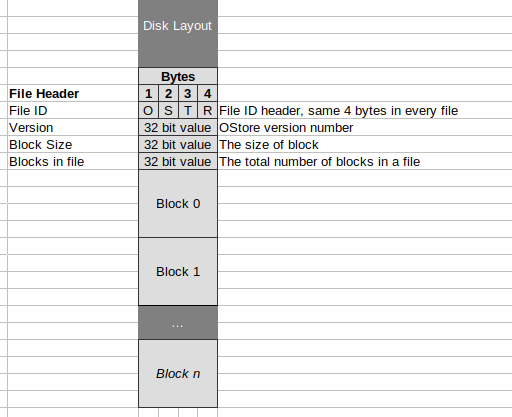
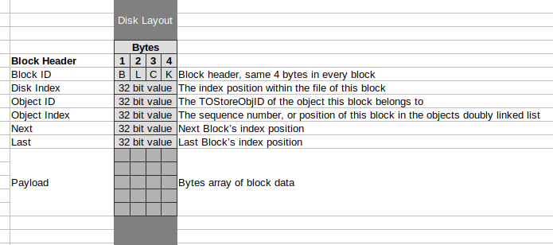
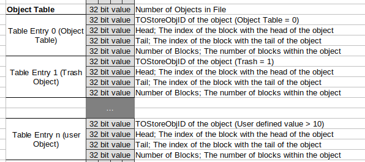

# OStore File Format

The OStore file format has a simple physical layout, with a file header, followed by a sequence of blocks. Because each block is of the same size the file can be considered an on disk array of blocks. Therefore blocks can be addressed by an array index value, rather than an offset value.

The basic premise is that the file contains a series of objects, were each object is constructed of a doubly linked list of blocks. Using this basic premise, a logical layout is then placed on top of the physical layout. The logical layout contains two objects, each or which always exist in every oStore. These two object are:

1. The Object Table, this is always present in the first block.
2. The Tash List; the list of free blocks which are currently unused. 

Both the Object Table and the Trash list are always present in the Object Table, and, yes the Object Table does indeed contain a reference to itself.

The document will initially describe the Physical File Structure, before describing the Object Table, within the Logical File Structure.

## Physical File Structure Overview

### File Header

The start of the file always includes a file header. This header contains an identification marker which identifies the file as being an "ostore file", this is then followed by some version information, the data payload size of each block within the file and the total number of blocks the file holds.

This allows the oStore to be configured with different block payload sizes depending on the data types being stored. At the time of writing the block size is set, hard coded in code as 128 bytes.

The File header is defined as follows:

- File Type Identifier : 32 bits, this is always the 4 bytes "OSTR".
- OStore Version Number : unit32_t, this is set to 1 at the time of writing.
- Block Size : uint32_t, this is set to 128.
- Number of Blocks in file. This is, obviously dependent on the size of the file. However, note that  the object index is always stored in block 0, therefore the minimum size of a oStore file is one block.

#### Code Mapping

This is mapped to the `TDskObjectStoreFileHeader` structure:

https://github.com/woodsmc/ostore/blob/4e40978d5c79a510e77fb92d4b99c12e564e8669/inc/ostore_internal.h#L89-L95

### Block Structure

With the exception of the file header all data is stored in a block. Each block contains a header. The headers always precede the "payload" or actual data being stored within the block. Since it is imagined that a block will only ever store data for an object, and that all objects have IDs, the block header always contains information to identify the object to which it belongs, it's position within the double linked list which constituents that object.

The block header is structure like this:

- Block Start Identifier : 32 bits - "BLCK"
- Block File Index : uint32_t : 0.. n
- Object Identification Number : uint32_t : 0..n
- Object Block Sequence Number : uint32_t
- Next Object Block Sequence Number : uint32_t
- Last Object Block Sequence Number : uint32_t
- Data payload : uint8_t [... block size... ]

Using this "Next" and "Last" fields which reference the physical location of each block, this structure allows us to construct a doubly linked list of data:

#### Code Mapping

This is mapped to the `TDskObjectStoreBlockHeader` structure:

https://github.com/woodsmc/ostore/blob/4e40978d5c79a510e77fb92d4b99c12e564e8669/inc/ostore_internal.h#L104-L112

## Logical File Structure Overview
As mentioned an oStore always contains an initial block, block zero (0), which itself contains an Object Table which has entries for every object within the file. It also, always contains a trash object (1) which contains all free blocks which can be reused when new objects, or increased space for an object is requested.

### Block Sequence Handling

An initial Block Sequence (Block 0) stores a table of objects. Objects are represented as a series of blocks, a "block sequence" if you will within the file. Each entry stores the initial header block, the tail block and the assigned ID of the block sequence.

The Object Handling data stores the number of blocks, then an entry per block:

- Number of Entries : uint32_t
- Then a sequence of::

  - ID : uint32_t
  - Head Block : uint32_t
  - Tail Block : uint32_t
  

This table entry is represented in code as `TDskObjIndex`:

https://github.com/woodsmc/ostore/blob/4e40978d5c79a510e77fb92d4b99c12e564e8669/inc/ostore_internal.h#L115-L121

#### Reserved IDs

There are a set of reserved ID values, these are used to store housekeeping information, they are as follows:

| ID   | Purpose                                              |
| ---- | ---------------------------------------------------- |
| 0    | Table of Objects                                     |
| 1    | Sequence of empty blocks which can be reused (Trash) |
|      |                                                      |

User created objects should not use these IDs, it would just cause corruption of data and the file.
